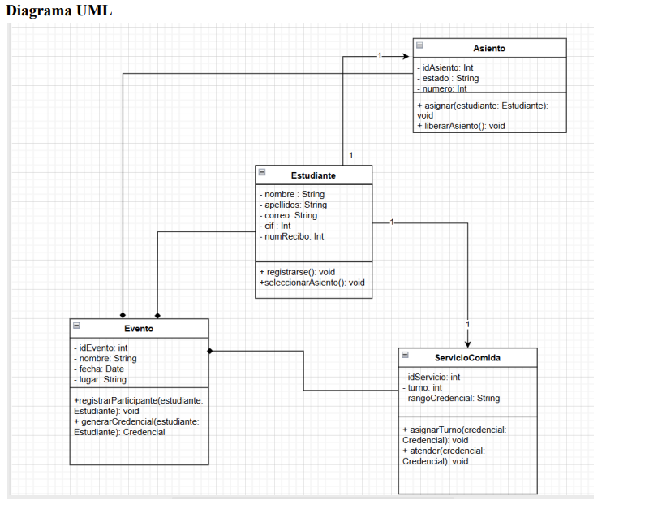

# Sistema de Asientos Systech

**Proyecto:** Sistema de asignación anticipada de asientos y orden de servicio de comida para el congreso SYSTECH.

**Autores:** Gabriela M. Guerrero Paiz, Steven L. Sequeira R., Allan R. V. Acuña O., Fernando G. Gazo G., Guillermo J. V. Vega.  

**Docente:** José Durán García.  

---

## 📌 Descripción
El Sistema de Asientos SYSTECH es una solución para organizar la asignación de asientos y gestionar el orden de servicio de comida en el congreso SYSTECH (celebrado el 11 de septiembre de 2025). Busca reducir desorden, tiempos de espera y la pérdida de asientos mediante registro previo, generación de credenciales y un mecanismo que define el orden de atención en las filas de comida. :contentReference[oaicite:0]{index=0}

---

## 🎯 Objetivos
- Asignación anticipada y controlada de asientos mediante registro en línea.
- Generación de credenciales únicas vinculadas a asientos.
- Ordenar el servicio de comida basado en numero de credenciales
- Incentivar el registro previo: usuarios sin registro reciben credenciales al final de la secuencia y son servidos al final.

---

## 📁 Diagrama UML de clases

